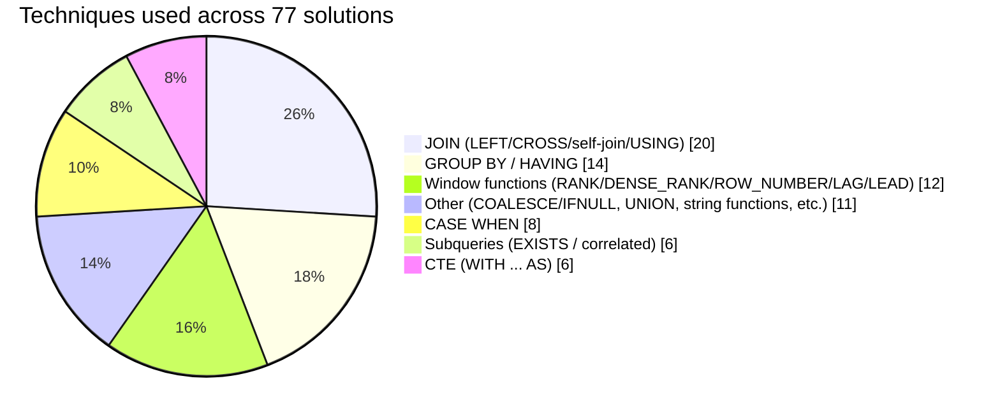

# LeetCode Solutions

### SQL solutions to LeetCode database problems, written in PostgreSQL.

<!-- TECHNIQUE_CHART_START -->

## Technique Breakdown

Primary technique per solution, auto-detected from the query text in `Problems/*.sql` (77 files). Regenerate with `python3 scripts/generate_readme_chart.py` after adding or editing a solution.

<!-- TECHNIQUE_CHART_END -->

## Notes
 
- Queries target PostgreSQL syntax by default (LeetCode's PostgreSQL option); a few (e.g. 1683 Invalid Tweets, 1934 Confirmation Rate) use MySQL where noted, since certain functions (`CHAR_LENGTH`, `IFNULL`, `IF()`) differ between dialects.
- Solutions prioritize correctness over what happens to pass LeetCode's specific test cases — some accepted submissions on LeetCode use logic that doesn't generalize (e.g., total `COUNT` instead of consecutive-row checks); those are noted where relevant.

## Author

[ruhlanrzayev](https://github.com/ruhlanrzayev)