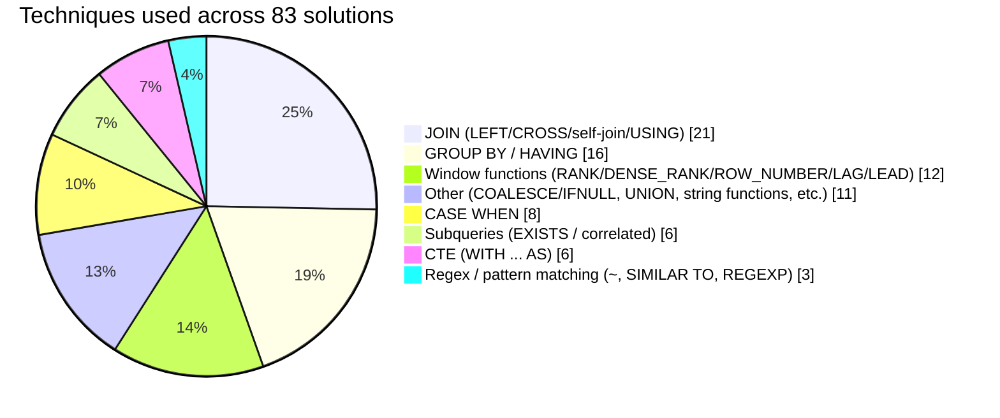

# LeetCode Solutions

### SQL solutions to LeetCode database problems, written in PostgreSQL.

<!-- TECHNIQUE_CHART_START -->

## Technique Breakdown

Primary technique per solution, auto-detected from the query text in `Problems/*.sql` (83 files). Regenerate with `python3 scripts/generate_readme_chart.py` after adding or editing a solution.

```mermaid
pie showData
    title Techniques used across 83 solutions
    "JOIN (LEFT/CROSS/self-join/USING)" : 21
    "GROUP BY / HAVING" : 16
    "Window functions (RANK/DENSE_RANK/ROW_NUMBER/LAG/LEAD)" : 12
    "Other (COALESCE/IFNULL, UNION, string functions, etc.)" : 11
    "CASE WHEN" : 8
    "Subqueries (EXISTS / correlated)" : 6
    "CTE (WITH ... AS)" : 6
    "Regex / pattern matching (~, SIMILAR TO, REGEXP)" : 3
```

<!-- TECHNIQUE_CHART_END -->

<!-- ID_LIST_START -->

## Problems by Technique

Which exact problem IDs were classified under each technique above (83 files). Also auto-generated by `python3 scripts/generate_readme_chart.py`.

- **JOIN (LEFT/CROSS/self-join/USING)** [21]: 175, 183, 184, 196, 550, 570, 577, 1075, 1158, 1174, 1204, 1251, 1280, 1327, 1378, 1407, 1587, 1633, 1731, 1934, 3521
- **GROUP BY / HAVING** [16]: 182, 511, 586, 596, 602, 619, 1045, 1050, 1141, 1484, 1693, 1729, 1741, 1890, 2356, 3705
- **Window functions (RANK/DENSE_RANK/ROW_NUMBER/LAG/LEAD)** [12]: 177, 178, 180, 185, 197, 626, 1070, 1321, 1341, 3421, 3564, 3580
- **Other (COALESCE/IFNULL, UNION, string functions, etc.)** [11]: 176, 181, 584, 595, 620, 1148, 1527, 1667, 1683, 1757, 1795
- **CASE WHEN** [8]: 610, 627, 1179, 1193, 1211, 1393, 3220, 3475
- **Subqueries (EXISTS / correlated)** [6]: 262, 607, 1084, 1581, 1789, 1978
- **CTE (WITH ... AS)** [6]: 608, 1164, 1661, 1907, 1965, 3497
- **Regex / pattern matching (~, SIMILAR TO, REGEXP)** [3]: 1517, 3436, 3465

<!-- ID_LIST_END -->

## Notes
 
- Queries target PostgreSQL syntax by default (LeetCode's PostgreSQL option); a few (e.g. 1683 Invalid Tweets, 1934 Confirmation Rate) use MySQL where noted, since certain functions (`CHAR_LENGTH`, `IFNULL`, `IF()`) differ between dialects.
- Solutions prioritize correctness over what happens to pass LeetCode's specific test cases — some accepted submissions on LeetCode use logic that doesn't generalize (e.g., total `COUNT` instead of consecutive-row checks); those are noted where relevant.

## Author

[ruhlanrzayev](https://github.com/ruhlanrzayev)